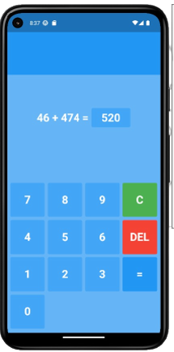
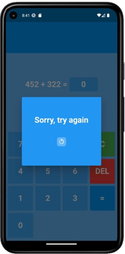

# Math Game

This is a simple Math game made in Flutter written in dart to further my learning of the Flutter framework. Once satisified I will resume react-native development.


## Installation
<details>
<summary>
  <code>There are several ways to save this repository on your device. Two of these options include:</code>
</summary>

- [Downloading repository as ZIP](https://github.com/carrot2803/math-game/archive/refs/heads/master.zip)
- Running the following command in a terminal, provided the [GitHub CLI](https://cli.github.com/) has been previously installed:
```sh
git clone https://github.com/carrot2803/math-game.git
```

<code>Install Flutter and dependencies:  </code>
You can download and install Flutter from the official Flutter website: https://flutter.dev

Run the following command to install the required dependencies:
```sh
flutter pub get
```
Run the app: Connect your device or emulator, and run the following command to launch the app:
```sh
flutter run
```
</details>

## Contributing

Contributions are welcome. If you have any ideas, suggestions, or bug reports, please create an issue or submit a pull request. You can also contact me at carrot#8856 on Discord.

## Snippets
<br/>
<br/>


## Acknowledgments

The Flutter and Dart communities for their amazing tools and support.
